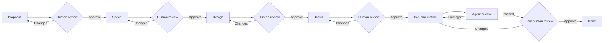

# Declarative workflow design

Status: proposed design. This document describes the intended replacement for
the fixed OpenSpec state machine; it is not the current runtime contract.

## Decision summary

- Workflow definitions are declarative, immutable, revisioned data.
- Built-in definitions are authored as typed TypeScript objects.
- A definition must contain only JSON-serializable values. TypeScript is an
  authoring convenience, not an executable workflow runtime.
- SQLite stores the canonical JSON snapshot for every workflow revision.
- A workflow run refers to exactly one immutable definition revision.
- The task-manager plugin owns orchestration, durable human-in-the-loop (HITL)
  decisions, artifacts, retries, invalidation, and bounded worker scheduling.
- The same definition is used to validate a workflow, render it before a run,
  and overlay live execution state after a run starts.

This design deliberately does not execute project-provided JavaScript. A later
import/export format may be JSON or JSONC without changing the runtime model.

## Why declarative

A declarative graph lets the plugin inspect the complete process before it is
started. The plugin can therefore:

- validate node references, artifact dependencies, preset bindings, terminal
  paths, and unsafe cycles;
- render the planned stages in the UI before a run exists;
- persist an exact revision and recover it after a restart;
- find all runnable nodes and apply worker limits without changing semantics;
- explain why a node is blocked, ready, invalidated, or waiting for a person;
- audit every transition without evaluating arbitrary callbacks.

## Terminology

The following concepts are distinct:

- **Definition**: immutable graph and metadata for one workflow revision.
- **Node**: one executable or blocking unit in the graph.
- **Node type**: runtime behavior of a node (`agent`, `human_gate`, or
  `terminal` in the first version).
- **Phase**: optional presentation grouping for the UI, such as OpenSpec,
  Implementation, and Verification. A phase has no transition semantics.
- **Run**: mutable execution state associated with a task and one definition
  revision.
- **Artifact**: versioned output produced by a node.
- **HITL gate**: durable decision unit associated with a task, run, node,
  reviewed artifacts, and optimistic version.
- **Preset slot**: logical agent role in a definition. A project binds the slot
  to a concrete provider/model/reasoning/permission preset.

The current `OpenSpecStage` enum mixes node identity, node type, and UI phase.
The generic model replaces it with stable node IDs plus independent node state.

## TypeScript authoring contract

Built-in workflows start as plain TypeScript data:

```ts
export interface WorkflowDefinition {
  schemaVersion: 1;
  id: string;
  revision: string;
  name: string;
  phases: WorkflowPhase[];
  presetSlots: PresetSlot[];
  nodes: WorkflowNode[];
}

export interface WorkflowPhase {
  id: string;
  title: string;
  description?: string;
}

export interface PresetSlot {
  id: string;
  title: string;
  description?: string;
}

export type WorkflowNode = AgentNode | HumanGateNode | TerminalNode;

export interface NodeBase {
  id: string;
  title: string;
  phase: string;
  after?: string[];
}

export interface AgentNode extends NodeBase {
  type: "agent";
  preset: string;
  prompt: string;
  consumes?: string[];
  produces?: string[];
  next?: string;
  routes?: DeclarativeRoute[];
}

export interface HumanGateNode extends NodeBase {
  type: "human_gate";
  reviews: string[];
  approve: string;
  requestChanges: {
    target: string | "selected_artifact";
    invalidate: "target" | "downstream";
  };
}

export interface TerminalNode extends NodeBase {
  type: "terminal";
  outcome: "completed";
}
```

The exact route-expression schema remains to be designed. It must be
declarative and JSON-serializable; functions and callbacks are not allowed.

Definitions may use small TypeScript helpers such as `agent()` or
`humanGate()`, provided those helpers only construct plain data. The following
must always succeed:

```ts
JSON.stringify(definition);
```

## Node types in the first version

### `agent`

Starts one BB thread using the preset bound to the node's logical preset slot.
It consumes declared context/artifacts and returns a validated structured
result. Agent review is not a separate node type; it is an `agent` with a
review prompt and review-result schema.

### `human_gate`

Creates a durable HITL unit and waits for an explicit decision. It identifies
the artifacts under review and declares the approve and request-changes
transitions. A gate with multiple dependencies is also a synchronization point:
it becomes ready only after every dependency completes.

### `terminal`

Completes the workflow run and applies the configured task outcome.

An explicit `join` node is not required initially. Multiple `after`
dependencies provide `all` semantics. Other policies such as `any`, quorum,
or fail-fast can be added only when a concrete workflow needs them.

## Dependencies, parallelism, and worker limits

Nodes become ready from their dependency state, not from array order. All
nodes whose dependencies are complete may be queued at the same time:

```ts
const nodes = [
  { id: "implementation", type: "agent" },
  { id: "security-review", type: "agent", after: ["implementation"] },
  { id: "quality-review", type: "agent", after: ["implementation"] },
  {
    id: "final-review",
    type: "human_gate",
    after: ["security-review", "quality-review"],
  },
];
```

`security-review` and `quality-review` are logically parallel. Physical
execution is bounded by the task-manager worker pool. If only one worker is
available, both nodes remain semantically parallel but run one after another
from the ready queue. The `final-review` gate waits for both.

The initial scheduler needs `all` dependency semantics and bounded FIFO
dispatch. Global, per-project, and per-preset concurrency policy remains an
open design decision.

## Definition storage and revisioning

The current `workflow_definitions` table stores only Markdown. The target
schema stores the executable definition separately from optional human-facing
instructions:

```sql
CREATE TABLE workflow_definitions (
  id TEXT NOT NULL,
  revision TEXT NOT NULL,
  schema_version INTEGER NOT NULL,
  name TEXT NOT NULL,
  definition_json TEXT NOT NULL,
  instructions_markdown TEXT NOT NULL DEFAULT '',
  created_at TEXT NOT NULL,
  PRIMARY KEY (id, revision)
);
```

Shipped migrations remain append-only. The existing migration must not be
edited; a new migration will add or rebuild the necessary columns/tables.

Definitions are immutable:

- editing a workflow creates a new revision;
- project bindings point to the revision used for future runs;
- active and historical runs retain their original revision;
- a referenced revision cannot be deleted while runs depend on it.

Project preset bindings are stored separately from definitions because preset
IDs are installation-specific:

```sql
CREATE TABLE project_workflow_presets (
  project_id TEXT NOT NULL,
  workflow_id TEXT NOT NULL,
  workflow_revision TEXT NOT NULL,
  slot_id TEXT NOT NULL,
  preset_id TEXT NOT NULL,
  PRIMARY KEY (project_id, workflow_id, workflow_revision, slot_id)
);
```

Resolved preset bindings should be snapshotted when a run starts so changing a
project binding cannot alter an active run.

## Run state

A generic run cannot have one OpenSpec-specific `stage`: parallel branches may
have several active nodes. Mutable state is stored per node:

```ts
export interface WorkflowRunState {
  nodes: Record<string, WorkflowNodeState>;
  artifacts: Record<string, WorkflowArtifact>;
  presetBindings: Record<string, string>;
}

export interface WorkflowNodeState {
  status:
    | "pending"
    | "queued"
    | "running"
    | "waiting_human"
    | "completed"
    | "failed"
    | "invalidated"
    | "cancelled";
  attempt: number;
  threadId?: string;
  output?: unknown;
  error?: string;
}
```

`workflow_runs.state_json` can hold the first implementation of this state.
`workflow_events` remains the ordered audit and recovery log. The current
`stage` column may temporarily contain a derived summary for compatibility,
but it cannot remain the source of truth.

Run writes continue to use the existing optimistic `version` guard. Realtime
events are notifications only; clients refetch durable state after receiving
one or reconnecting.

## HITL storage

Human review is a task-manager domain concept rather than a generic BB worker
operation. A durable gate must bind a decision to its task and exact reviewed
artifact versions:

```ts
export interface WorkflowHumanGate {
  id: string;
  taskId: string;
  runId: string;
  nodeId: string;
  runVersion: number;
  subjects: Array<{ artifactId: string; digest: string }>;
  status: "pending" | "approved" | "changes_requested" | "superseded";
  decision?: {
    comment: string;
    targetArtifact?: string;
  };
}
```

The database may use a dedicated `workflow_human_gates` table or a normalized
projection backed by events. In either case, gate resolution must atomically:

1. verify the expected run and gate versions;
2. verify that all reviewed artifact digests are unchanged;
3. persist the decision and workflow event;
4. apply invalidation and new ready-node state;
5. publish a state-changed notification.

Repeated or stale decisions must fail closed.

## Artifacts and invalidation

Artifacts need lifecycle state independent of human approval:

```ts
type ArtifactStatus = "produced" | "approved" | "invalidated";
```

This distinction supports both OpenSpec policies:

- review each artifact before downstream generation;
- generate all OpenSpec artifacts and review the bundle afterward.

When changes are requested for an artifact, the selected artifact and every
transitively dependent artifact/node are invalidated. Previous attempts remain
in the event log; the active state points to the latest attempt.

Artifact paths must remain confined to the run environment. Digest verification
continues before a human decision is accepted.

## Current OpenSpec definition

The existing implementation has twelve fixed stages. The declarative
definition can present them as three proposed UI phases:

```ts
export const currentOpenSpec = {
  schemaVersion: 1,
  id: "openspec",
  revision: "1",
  name: "OpenSpec: review every artifact",
  phases: [
    { id: "openspec", title: "OpenSpec" },
    { id: "implementation", title: "Implementation" },
    { id: "verification", title: "Verification" },
  ],
  presetSlots: [
    { id: "drafting", title: "OpenSpec drafting" },
    { id: "implementation", title: "Implementation" },
    { id: "review", title: "Independent review" },
  ],
  nodes: [
    { id: "proposal", title: "Proposal", phase: "openspec", type: "agent",
      preset: "drafting", produces: ["proposal"], next: "proposal-review" },
    { id: "proposal-review", title: "Proposal review", phase: "openspec",
      type: "human_gate", reviews: ["proposal"], approve: "specs",
      requestChanges: { target: "proposal", invalidate: "downstream" } },
    { id: "specs", title: "Specifications", phase: "openspec", type: "agent",
      preset: "drafting", consumes: ["proposal"], produces: ["specs"],
      next: "specs-review" },
    { id: "specs-review", title: "Specifications review", phase: "openspec",
      type: "human_gate", reviews: ["specs"], approve: "design",
      requestChanges: { target: "specs", invalidate: "downstream" } },
    { id: "design", title: "Design", phase: "openspec", type: "agent",
      preset: "drafting", consumes: ["proposal", "specs"],
      produces: ["design"], next: "design-review" },
    { id: "design-review", title: "Design review", phase: "openspec",
      type: "human_gate", reviews: ["design"], approve: "tasks",
      requestChanges: { target: "design", invalidate: "downstream" } },
    { id: "tasks", title: "Task breakdown", phase: "openspec", type: "agent",
      preset: "drafting", consumes: ["proposal", "specs", "design"],
      produces: ["tasks"], next: "tasks-review" },
    { id: "tasks-review", title: "Tasks review", phase: "openspec",
      type: "human_gate", reviews: ["tasks"], approve: "implementation",
      requestChanges: { target: "tasks", invalidate: "downstream" } },
    { id: "implementation", title: "Implementation", phase: "implementation",
      type: "agent", preset: "implementation",
      consumes: ["proposal", "specs", "design", "tasks"],
      produces: ["implementation"], next: "implementation-review" },
    { id: "implementation-review", title: "Implementation review",
      phase: "verification", type: "agent", preset: "review",
      consumes: ["implementation"], produces: ["review-result"],
      routes: [
        { when: { output: "review-result", path: "passed", equals: true },
          goto: "final-review" },
        { otherwise: true, goto: "implementation",
          invalidate: ["implementation", "review-result"] },
      ] },
    { id: "final-review", title: "Final review", phase: "verification",
      type: "human_gate", reviews: ["implementation", "review-result"],
      approve: "done",
      requestChanges: { target: "implementation", invalidate: "downstream" } },
    { id: "done", title: "Done", phase: "verification", type: "terminal",
      outcome: "completed" },
  ],
} satisfies WorkflowDefinition;
```

The prompt fields are omitted here to keep the graph readable. The persisted
definition contains either inline prompts or prompt references once that open
question is resolved.

### OpenSpec phase

1. `proposal`: agent produces the proposal.
2. `proposal-review`: human approves it or returns to `proposal`.
3. `specs`: agent produces specifications from the approved proposal.
4. `specs-review`: human approves them or returns to `specs`.
5. `design`: agent produces the design from approved proposal and specs.
6. `design-review`: human approves it or returns to `design`.
7. `tasks`: agent produces the task breakdown from approved artifacts.
8. `tasks-review`: human approves it or returns to `tasks`.

### Implementation phase

9. `implementation`: agent implements the approved tasks.

### Verification phase

10. `implementation-review`: independent agent reviews the implementation.
    Findings invalidate the implementation and return to node 9.
11. `final-review`: human reviews the implementation and agent-review evidence.
    Requested changes invalidate the implementation and return to node 9.
12. `done`: terminal node completes the run and task.



A second definition can move the first four human gates after `tasks` without
changing the engine. The bundle gate reviews proposal, specs, design, and tasks;
requesting changes for one artifact invalidates that artifact and its
downstream dependants.

## UI projection

Before a run, the UI renders the definition with every node in a `planned`
visual state. It can show:

- phases and node order/dependencies;
- agent versus human nodes;
- consumed and produced artifacts;
- approve and request-changes paths;
- logical preset slots and missing project bindings;
- validation errors and warnings.

After a run starts, the same graph receives a runtime overlay from node state.
The first UI should be a read-only stage map, not a free-form graph editor.
The mostly linear current OpenSpec definition can use a stepper; parallel
branches can render as lanes that converge on a gate.

## Definition validation

A definition is rejected before it can be bound to a project when:

- IDs are missing or duplicated;
- a node references an unknown phase, node, artifact, or preset slot;
- a consumed artifact has no possible producer;
- an approve, request-changes, or route target does not exist;
- no terminal node is reachable;
- an unintended cycle has no HITL boundary or retry bound;
- a node type contains unsupported or non-JSON data;
- the definition exceeds configured size/depth limits.

Validation should return stable, path-addressed issues suitable for both RPC
errors and inline UI diagnostics.

## First implementation scope

The first implementation should:

1. introduce plain-data TypeScript definition types and validation;
2. express the current OpenSpec flow as one built-in definition;
3. persist immutable JSON revisions and project preset-slot bindings;
4. replace the fixed reducer with generic per-node readiness and invalidation;
5. retain durable events, optimistic concurrency, digest verification, thread
   reconciliation, and the current human-review UI;
6. render a read-only definition preview and live runtime overlay;
7. add the review-at-end OpenSpec variant as the first proof that the graph is
   configurable.

## Non-goals for the first version

- Executing project-provided JavaScript or callbacks.
- A visual drag-and-drop workflow editor.
- YAML or TOML authoring.
- Dynamic node creation or unbounded fan-out.
- `any`, quorum, or custom join policies.
- Arbitrary expression evaluation.
- Scheduled timers, cron nodes, or generalized external webhooks.
- Parallel agents editing the same workspace files without an explicit
  isolation and merge policy.
- Replacing BB's general-purpose workflows plugin.

## Open questions

- Should prompts be inline strings, referenced Markdown templates, or both?
- What structured-output schemas are supported by agent nodes, and how are
  schemas represented in persisted JSON?
- Which preset fields are snapshotted: preset ID only, or resolved provider,
  model, reasoning, permissions, and environment policy?
- What are the global, per-project, per-run, and per-preset concurrency limits?
- Are parallel writers prohibited initially, or isolated into separate
  environments/worktrees?
- How are manual cancellation, node retry, run failure, and task status mapped?
- Should human gates have their own table or remain an event-backed projection?
- How are definition schema migrations handled when a future runtime reads an
  older immutable revision?
